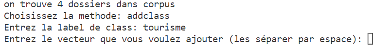
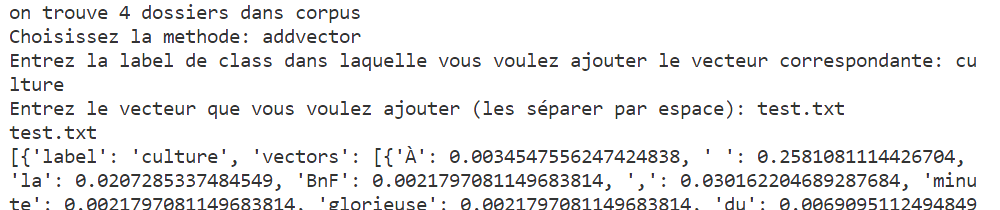
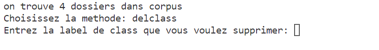
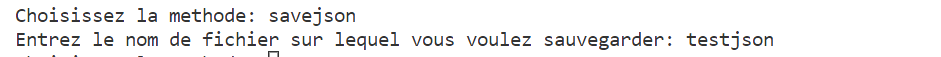
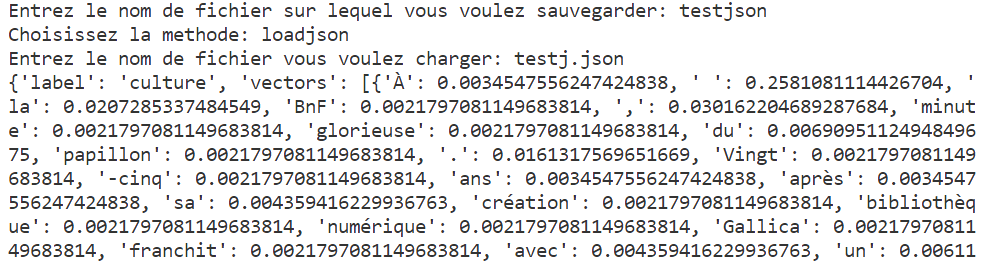
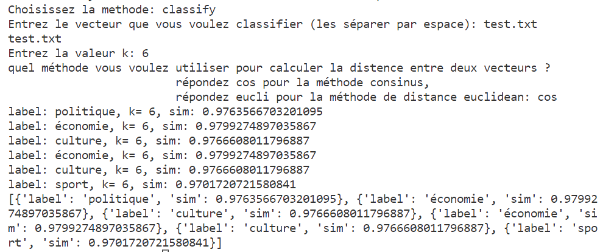

# projet KNN

## Introduction
Ce projet se concentre sur la classification supervisée KNN dans le but de classifier les textes. 
La première partie de ce projet **classTexVec**, qui consiste à traiter les données textuelles et à les transformer en ce qu'on a besoin en dans la classe `classKNNclasses`. Dans ce processus de préparation de données, on utilise les méthodes de _tokenize_, _vertoriser_,_filtrer_,et l'algorithme de _ti-idf_ pour identifier le thème et prend les données sous forme de cette structure ci-dessous en sortie.
_[ { "label": "XXX_1",
	"vectors": [
			{ "key_1_1_1": float_1_1_1, "key_1_1_2":float_1_1_2,... },
			{ "key_1_2_1": float_1_2_1, "key_1_2_2":float_1_2_2,... },...]},
{ "label": "XXX_2",
"vectors": [{ "key_2_1_1": float_2_1_1, "key_2_1_2":float_2_1_2,... },
			{ "key_2_2_1": float_2_2_1, "key_2_2_2":float_2_2_2,... }, ...]}
			......
]_

La deuxième partie de ce projet **"classKNNclasses"** est la partie principale et l'étape de réalisation de classification. Cette classe possède deux propriétaires "description" et "data", ainsi que plusieurs méthodes tels que add_class, add_vector, del_class, save_as_json, load_as_json,classify etc. L'idée importante consiste à classifier des points cibles (classe méconnue) en fonction de leurs distances par rapport à des points constituant un échantillon d'apprentissage (c'est-à-dire dont la classe est connue a priori), ici la distance soit la similarité consinus soit la distance euclidienne.

La dernière partie de **classMain** s'agit d'une interface de l'utilisateur et en même temps qui sert à tester les algorithmes. Les utilisateurs peuvent choisir les méthodes en tapant sur le clavier.

Dans ce projet, le dossier _corpus_ est les textes des nouvelles sur le site _20 Minutes_ qui servent l'échantillon d'apprentissage. Le dossier _data_ comprend la liste de stopwords et les documents de test. Et un autre dossier _exemple_ est justement les captures d'écran de test.

## Install

- import math
- import json
- import re
- import os
- import copy

## API
 
### classTexVec
`def tokenize(text)->str:`   

Description:Cette fonction tokenize le texte en entrée utilisant les expressions régulières.
Le paramètre 'text' est obligatoire.
- input: text  (str)
- output: une liste de token (list)

`def vectorise(tokens:list)->dict:`

Description:Cette fonction prend une liste de tokens en entrée et sort un dictionnaire contenant de token comme "key" et leur fréquence comme "value".
- input: une liste de tokens (list)
- output: un dictionnaire  structure:{token1:fréquence1, token2:fréquence2, token3:fréquence3....}

`def read_text(filename:str)->list:`

Description: Cette fonction a pour objectif de lire un fichier, et de traiter les données textuelles en utilisant tokenize vectorise.
- input: le nom du fichier (str)
- output:une liste contenant le vecteur de cette structure:[{token1:fréquence1, token2:fréquence2, token3:fréquence3....}]

`def doc2vec(filename:str)->list:`

Description:  Traiter  les textes  d'un dossier, et prendre la structure de data en sortie.
- input: le nom du dossier (str)
- output: une liste contenant des vecteurs sous forme de structure data. 

structure data:
[{"label":1, "vectors":[{t1:1,t2:2,....},{t7:7,t8:8,t9:9,....},....]},
{"label":2, "vectors":[{txx:xx,txx:xx,....},{txx:xx,txx:xx,....},...]}...]

`def filtrer(data:list,stopwords:str,hapax:bool)->list:`

Description: filtrer les mots dans la liste de stopwords et qui apparaissent seulement une fois.
- input: data (list); le nom du fichier de stopwords (str); hapax (bool)
- output:une list sous forme de structure data.

`def tf_idf (data:list)->list:`

Description:cette méthode consiste à mettre à jour les valeurs correspondantes des "clé" token par les algorithmes de tf-idf.
- input:une liste de structure data
- output: une liste de structure data

`def traintovect(cls):`

Description: cette méthode est utilisée pour transformer les textes pour constituer l'échantillon d'apprentissage sous forme de structure data.

`def testtovect(cls,filename):`

Description: cette méthode est utilisée pour transformer le fichier de test en vecteur.

### classKNNclasses
`def printclass(self):`

Description: Il s'agit directement d'afficher les données data.

`def add_class(self,label:str,vectors:list):`

Description: cette méthode consiste à ajouter une classe aux données data.
- input: label(str);vectors(list)
- output: data (list)

`def add_vector(self, label:str, vector:list):`

Description: cette méthode consiste à ajouter les vecteurs à une class existante en utilisant le label comme index.
- input: label(str); vector(list)
- output: data (list)

`def del_class(self,label:str):`

Description: cette méthode a pour objectif de supprimer une classe.
- input: label de classe(str)
- output: data (list)

`def save_as_json(self,filename:str):`

Description: on peut utiliser cette méthode pour sauvegarder les données dans un fichier avec extention json.
- input: le nom du fichier(str)

`def load_as_json(self,filename:str):`

Description: on peut utiliser cette méthode à télécharger et afficher un fichier json.
- input: le nom du fichier(str)

`def vect_to_value_list(vect:dict)->list:`

Description: cette méthode est une partie de préparation pour calculer la distance euclidienne. Il s'agit de sortir les valeurs d'un dictionnaire et les mettre dans une liste.
- input: vect (dict)
- output: valuelist (list)

`def eucliDist(vect1:dict,vect2:dict)->float:`

Description: Cette méthode est utilisée pour calculer la distance euclidienne entre deux vecteurs, qui est une façon pour déterminer les k points les plus proches.
- input: vect1 vect2 (dict)
- output: valeur de la distance euclidienne (float)

`def dotvalue(vector1:dict,vector2:dict)->float:`

Description: Cette méthode s'agit de calculer la somme des produits des éléments de même index "clé" dans les deux vecteurs, qui est utilisée dans la méthode de cosinus.
- input: vector1 vector2 (dict)
- output: la valeur dot (float)

`def normalise(vector:dict)->float:`

Description: cette méthode consiste à normaliser les vecteurs ayant la longueur différente pour mieux calculer la similarité cosinus.
- input: vector (dict)
- output: la norme du vecteur (float)

`def cosinus(vector1,vector2)->float:`

Description: c'est la méthode de calculer la similarité entre deux vecteurs. En ce cas, on appelle les fonctions `dotvalue` et `normalise`.
- input: vector (dict)
- output: la valeur de la similarité cosinus (float)

`def classify(self,vector:dict,k:int, sim_func)->list:`

Description: cette méthode est la partie principale pour trouver les k points les plus proches afin de classifier le document de test.
- input: vector de classifier: (dict); k: (int); sim_func: (function)
- une liste des classes des k plus proches de point cible.

## Guide d'utilisation
Dès l'exécution de ce programme, il faut taper sur le clavier quelle méthode à utiliser.
1. **méthode add_class**

Il faut taper la label (str) et les vecteurs de la class que vous voulez ajouter aux données.
Le vecteur peut être sous forme de filename(str) ou directement les vecteurs(dict).

2. **méthode add_vector**

Il faut taper la label (str) et les vecteurs de la class que vous voulez ajouter aux données.
Le vecteur peut être sous forme de filename(str) ou directement les vecteurs(dict).
La différence entre méthode 1 et 2 est que le label dans méthode 2 existe déjà.

3. **méthode del_class**

Input s'agit du nom de label de classe (str) que vous voulez supprimer.

4. **méthode save_as_json**

Il faut entrer le nom du fichier (str) dans lequel vous voulez sauvegarder les données.
C'est juste le nom de fichier sans extention _.json_.

5. **méthode load_as_json**

Input est le nom du fichier (str) que vous voulez charger. Une fois terminé l'input, le contenu du fichier s'affiche.

6. **méthode classify**

Il y a plusieurs inputs pour les utilisateurs.
vector: soit le nom de fichier de test (str), soit directement le vecteur de test (dict).
le chiffre de k(int) 
sim_func, la méthode de calculer la distance: soit la méthode cosinus en tapant "cos", soit la méthode euclidienne en tapant "eucli".

7. **méthode printclass**

Il s'agit d'afficher les données directement.

## Des bogues
- Quand l'utilisateur veut effectuer un input de vecteur de test, s'il agit de forme d'un fichier, il faut taper directement le nom de fichier sans guillemets. C'est un problème facile à négliger pendant le processus de test.

## Améliorations possibles
- L'interface de l'utilisateur peut être plus pratique et beau à utiliser. Il est possible d'améliorer l'efficacité d'exécuter ce programme.
- Il est capable seulement de voir le label de class, mais n'arrive pas à savoir que chaque vecteur dans la class appartient à quel texte. Par exemple, on ne sait que le texte de test appartient le plus possible à la class sport, mais on ne sait pas qu'il peut être classifié à la rubrique de football, rugby, tennis ou cyclisme.
- Dans les méthodes de `read_text` et `doc2vec` de classTexVec, il existe une même partie de lire chaque fichier, tokeniser le contenu, et après vectoriser les tokens. Il est possible d'écrire une autre méthode de remplacer cette partie. C'est-à-dire on ne peut appeler que cette fonction dans les deux méthodes, ça vaut mieux d'économiser la mémoire et le temps.
